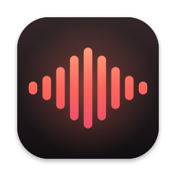
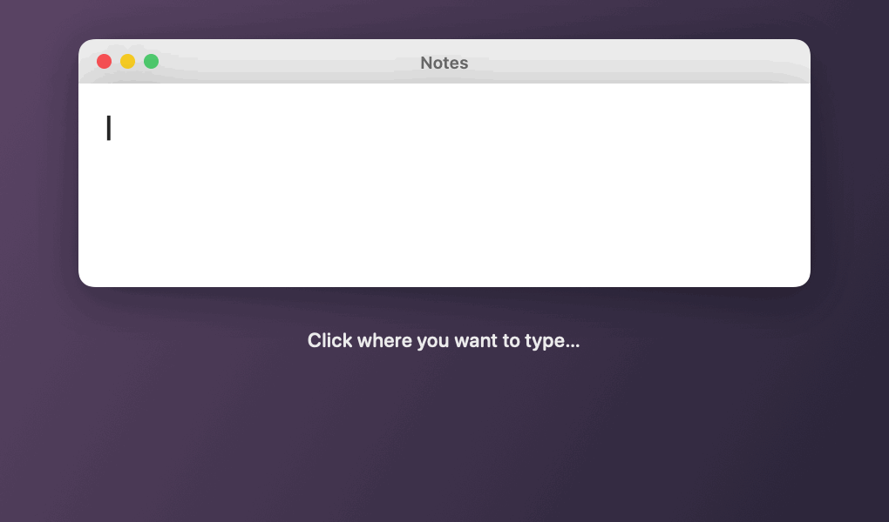
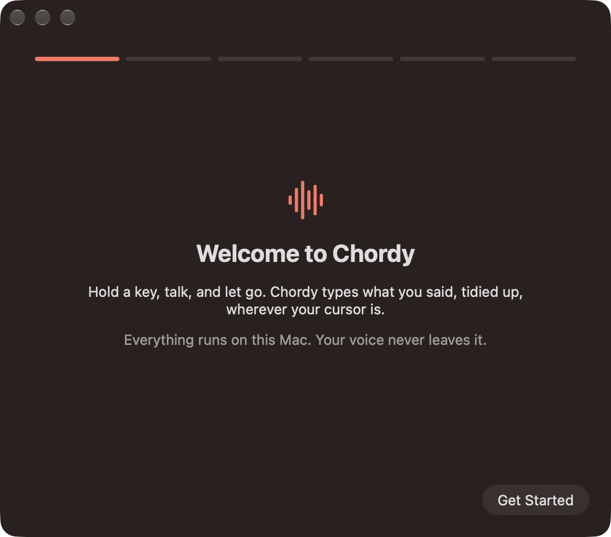
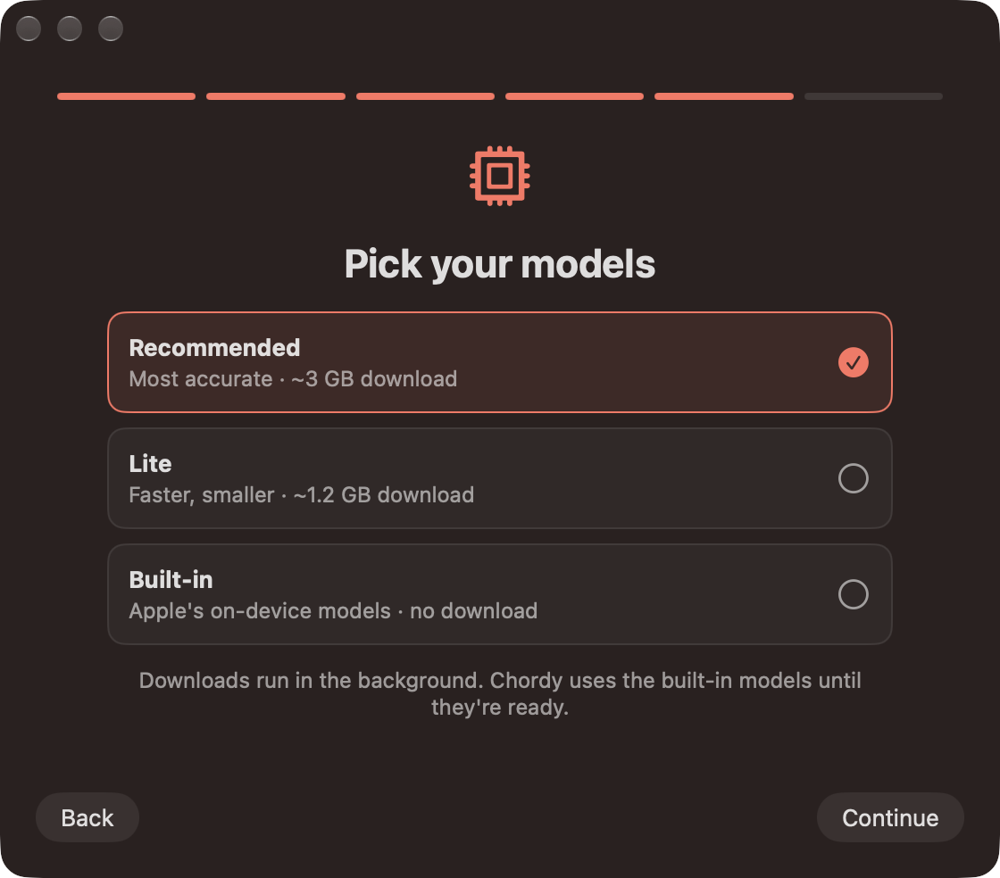
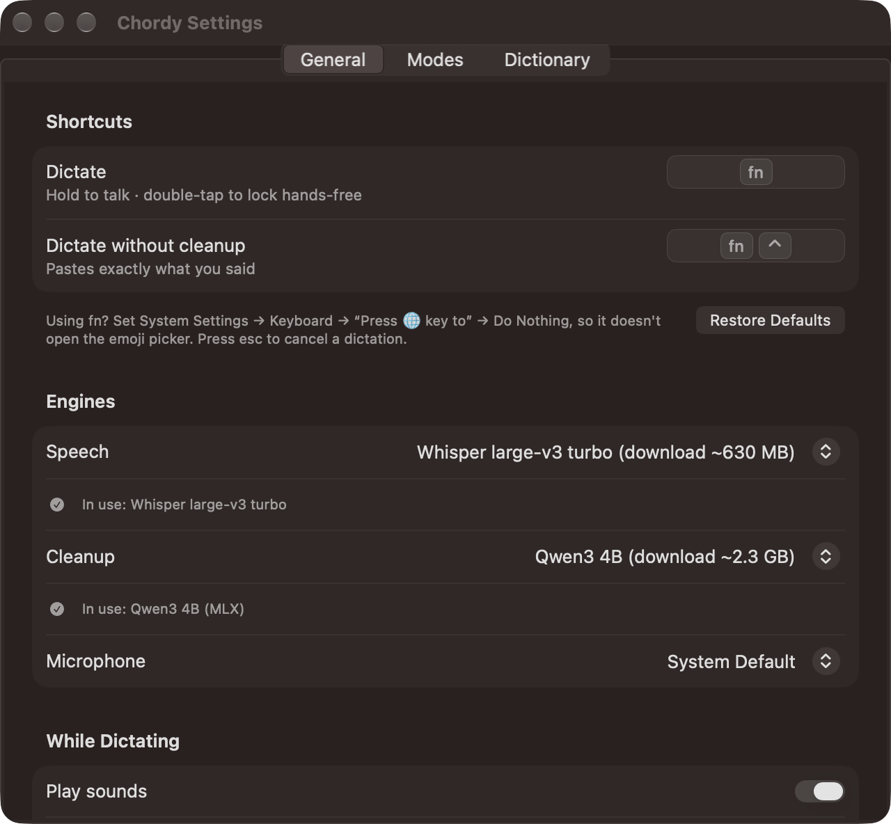
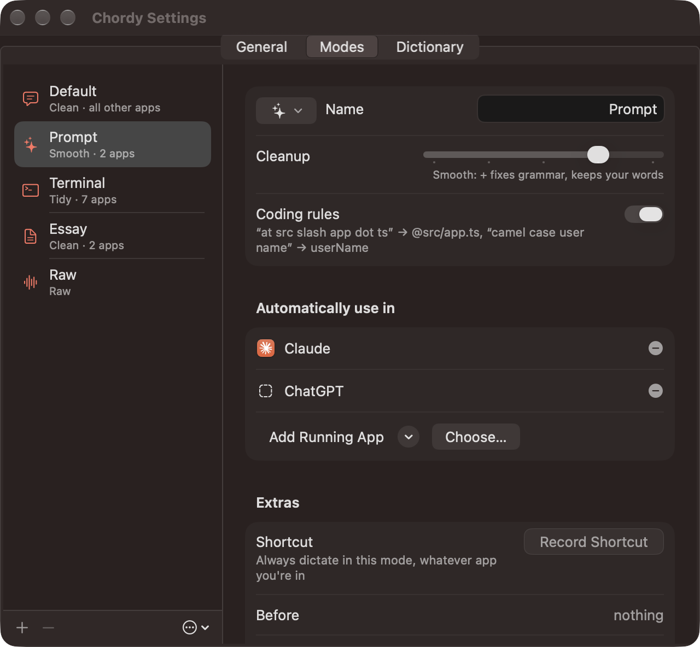
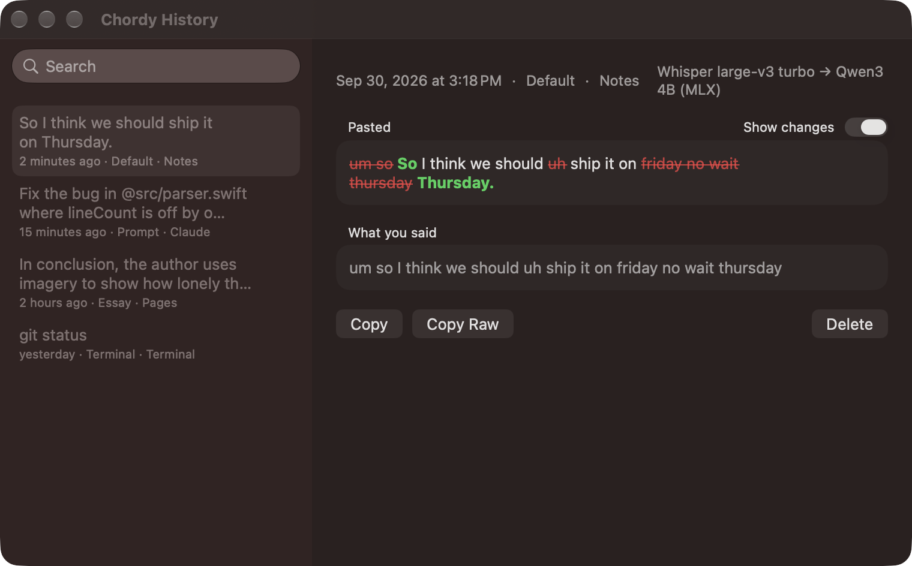

<p align="center">
  
</p>

<h1 align="center">Chordy</h1>

<p align="center">
  <b>Talk instead of type, on any app on your Mac.</b><br>
  Hold <kbd>fn</kbd>, say what you want to write, let go. Chordy types it for you, with the ums taken out.<br>
  Free. Works offline. Your voice never leaves your Mac.
</p>

<p align="center">
  <a href="../../releases/latest"><b>⬇️ Download Chordy for Mac</b></a>
</p>

<p align="center">
  
</p>

---

## What you need

- A Mac with an **Apple chip** (M1, M2, M3, M4…). Check under  → About This Mac.
- **macOS 26 (Tahoe)** or newer.
- About **3 GB of free space** for the best models. Chordy also works with no download at all, just less accurately.

## Install it (5 minutes, one time)

**1. Download.** Click [**Download Chordy for Mac**](../../releases/latest) and get `Chordy-1.0.zip`.

**2. Unzip and move.** Double-click the zip. Drag **Chordy** into your **Applications** folder.

**3. Open it.** Double-click Chordy. macOS will say *"Chordy" can't be opened because Apple cannot check it for malicious software.* That's normal. Chordy is free and isn't registered with Apple (registering costs $99 a year). Click **Done**.

**4. Allow it once.** Open **System Settings → Privacy & Security**. Scroll to the bottom and you'll see *"Chordy" was blocked…*. Click **Open Anyway**, then **Open Anyway** again, and type your Mac password if asked. You never have to do this again.

**5. Follow the setup guide.** It opens by itself:

<p align="center"> </p>

It asks for three things:

| It asks for… | Why | What to click |
|---|---|---|
| 🎤 **Microphone** | To hear you (only while you hold the key) | **Allow Microphone** → **Allow** |
| ⌨️ **Accessibility** | To notice the fn key and type the text for you | **Open Accessibility Settings**, then switch **Chordy** on |
| 🌐 **fn key** | So fn doesn't open the emoji picker | **Open Keyboard Settings** → *Press 🌐 key to* → **Do Nothing** |

Then pick **Recommended** and try it in the box. Done! 🎉

You'll now see a little **waveform icon** in the top-right menu bar. That's Chordy. It has no window; it just waits for you.

## How to use it

Click wherever you want to type (an email, a Google Doc, a chat box, anywhere), then:

| Do this | What happens |
|---|---|
| **Hold <kbd>fn</kbd>** and talk, then let go | Your words are typed, cleaned up |
| **Double-tap <kbd>fn</kbd>** | Hands-free: talk as long as you like, press <kbd>fn</kbd> again to finish |
| Hold **<kbd>fn</kbd> + <kbd>⌃ control</kbd>** | Types *exactly* what you said, no cleanup |
| Press <kbd>esc</kbd> | Cancel, nothing gets typed |
| Click **↩ Raw** right after it types | Swap the cleaned text for exactly what you said |

While you talk, a little pill appears at the bottom of your screen:

<p align="center"> </p>

### Things you can say

| You say | Chordy types |
|---|---|
| "um so I think uh we should go" | So I think we should go. |
| "let's meet at 3 no wait 4" | Let's meet at 4. |
| "first point **new line** second point" | First point<br>Second point |
| "intro **new paragraph** body" | Intro<br><br>Body |
| "what's the capital of France" | What's the capital of France? *(it writes your question; it never answers it)* |

**For coders:** "fix **at** src **slash** app **dot** ts" → `fix @src/app.ts`, and "**camel case** user name" → `userName` (also snake case, kebab case, pascal case and constant case).

## Make it yours

Click the menu-bar icon → **Settings…**

<p align="center"> </p>

**Change the key.** In **General**, click the shortcut and press the key(s) you want instead, like Right ⌥ or ⌥ Space.

**Modes.** Chordy cleans up differently depending on the app you're in:

| Mode | Used in | How much cleanup |
|---|---|---|
| **Default** | everything else | Clean: removes ums and self-corrections |
| **Prompt** | Claude, ChatGPT | Smooth: also fixes grammar |
| **Terminal** | Terminal, iTerm, Ghostty, Warp… | Tidy: just spacing and capitals |
| **Essay** | Pages, Word | Clean, no coding rules |
| **Raw** | when you hold fn + ⌃ | Nothing: exactly what you said |

The **Cleanup** slider has five steps: **Raw → Tidy → Clean → Smooth → Polish**. Slide it right for more cleanup. Add any app to a mode with **Add Running App**, or make your own mode with **+**.

**Dictionary.** If Chordy keeps mishearing a word (a name, a teacher, a game), add it under **Dictionary → Words**. Put what it *thinks* it heard in "Sounds like", for example `Chordy` sounds like `cordy`.

**Snippets.** Say a short phrase and get longer text. For example, saying "my email" types `me@example.com`.

## neo-plan (optional)

If you use [neo-plan](https://neo-plan.vercel.app), Chordy can talk to it. Both features are **off** until you turn them on in **Settings → neo-plan**:

- **Add items by voice.** Hold **fn + ⌥** and say "chemistry quiz due Friday". It shows up in that class, on Friday.
- **Mark done and turned in by voice.** Hold **fn + ⌥** and say "done with problem set 4" or "turned in the titration lab".

The pill tells you what changed, with an **Undo** button for a few seconds. To connect, make a token in neo-plan (**Settings → Extension → New token**) and paste it into Chordy. It's kept in your Keychain.

## History

Menu-bar icon → **History…** shows everything you've said in the last 30 days, what Chordy changed (red = removed, green = added), and buttons to copy it again.

<p align="center"></p>

It's text only (audio is never saved) and stays on your Mac. You can change how long it's kept, or turn it off, in Settings → General → **Keep history**.

## Help! Something's wrong

<details>
<summary><b>I hold fn and nothing happens</b></summary>

Chordy needs **Accessibility** access. Open **System Settings → Privacy & Security → Accessibility** and make sure **Chordy** is switched on. If it already is, switch it off and on again. You can also click the menu-bar icon → **Setup Guide…** to go through the steps again.
</details>

<details>
<summary><b>fn opens the emoji picker / changes my keyboard</b></summary>

**System Settings → Keyboard → "Press 🌐 key to" → Do Nothing.** Or pick a different key in Chordy's Settings.
</details>

<details>
<summary><b>It says "Didn't catch that"</b></summary>

It didn't hear any speech. Check the right microphone is picked in **Settings → General → Microphone**, and talk a little louder or closer.
</details>

<details>
<summary><b>How do I know which model it's using?</b></summary>

Click the menu-bar icon. The top of the menu says **Speech:** and **Cleanup:** with the models running right now. Just after you start your Mac they may say "Apple" for a minute while the better models load. Each entry in History also shows which models made it.
</details>

<details>
<summary><b>The download is stuck or failed (school / work Wi-Fi)</b></summary>

Some networks (like school filters) block huggingface.co, where the models come from. Chordy keeps working with Apple's built-in models and tells you why in the menu. Connect to a different network (like home Wi-Fi) once, and the download finishes by itself.
</details>

<details>
<summary><b>It changed something I didn't want</b></summary>

Click **↩ Raw** in the pill right after it types, or hold **fn + ⌃** next time for no cleanup. You can also move that app's mode slider left (Settings → Modes).
</details>

<details>
<summary><b>How do I quit or uninstall it?</b></summary>

Quit: menu-bar icon → **Quit Chordy**. Uninstall: drag Chordy from Applications to the Trash. To free the space the models use, also delete these (in Finder: **Go → Go to Folder…** and paste each path):

- `~/Library/Application Support/Chordy`: history, dictionary and speech models
- `~/.cache/huggingface/hub/models--mlx-community--Qwen3-4B-Instruct-2507-4bit` (and `…Qwen3-1.7B-4bit` if you picked Lite): cleanup models
</details>

## Privacy

Everything happens **on your Mac**. No accounts, no internet needed after setup, no tracking. Audio is thrown away as soon as it's turned into text. The only thing Chordy ever downloads is the speech and cleanup models, once. The one exception is neo-plan, if you turn it on: then whatever you say with the neo-plan shortcut (and only that) is sent to neo-plan.

---

## For developers

<details>
<summary>How it works, building from source, and tests</summary>

**How it works:** microphone (16 kHz) → speech-to-text ([WhisperKit](https://github.com/argmaxinc/WhisperKit), or Apple SpeechAnalyzer) → fixed rules (spoken "new line", fillers, `@paths`, casing) → a small local language model (Qwen3 via [MLX](https://github.com/ml-explore/mlx-swift-lm), or Apple Intelligence) → a guard that throws the model's version away if it changed too much → paste. Design decisions are in [SPEC.md](SPEC.md).

| Setup | Speech | Cleanup | Download |
|---|---|---|---|
| Recommended | Whisper large-v3 turbo | Qwen3 4B | ~3 GB |
| Lite | Whisper small.en | Qwen3 1.7B | ~1.2 GB |
| Built-in | Apple SpeechAnalyzer | Apple Intelligence | none |

**Build** (Xcode 26, plus the one-time Metal toolchain for MLX):

```bash
xcodebuild -downloadComponent MetalToolchain
./scripts/run.sh          # build, copy to ~/Applications, launch
./scripts/release.sh      # Release build → build/Chordy-<version>.zip
```

Sign with your own (free) team: open `chordy.xcodeproj` → target **chordy** → Signing & Capabilities → Team. Use the **Chordy App** scheme (the plain `chordy` scheme is the command-line tool). Builds go to `$TMPDIR` because files under `~/Documents` get extended attributes that break code signing. The scripts pass `-skipMacroValidation` for mlx-swift-lm's macro; in the Xcode app, click **Trust & Enable** instead.

**Core package, CLI and evals:**

```bash
cd Packages/ChordyCore
swift test
swift run chordy process "um at src slash app dot ts has a bug no wait two bugs" --level 2
swift run chordy transcribe recording.wav --engine whisper
swift run chordy eval --verbose      # 40 messy → clean cases
```

| Cleanup model | Exact (of 40) | Similarity |
|---|---|---|
| Qwen3 4B | 27 | 0.97 |
| Apple Intelligence | 25 | 0.95 |
| Qwen3 1.7B | 23 | 0.93 |

The Debug app has helpers for README images and evals: `--mlx-eval <cases.json> [recommended|lite]`, `--render-pill <dir>`, `--render-demo <dir>` and `--showcase <screen>`. The icon is drawn by `design/make-icon.swift`.
</details>
